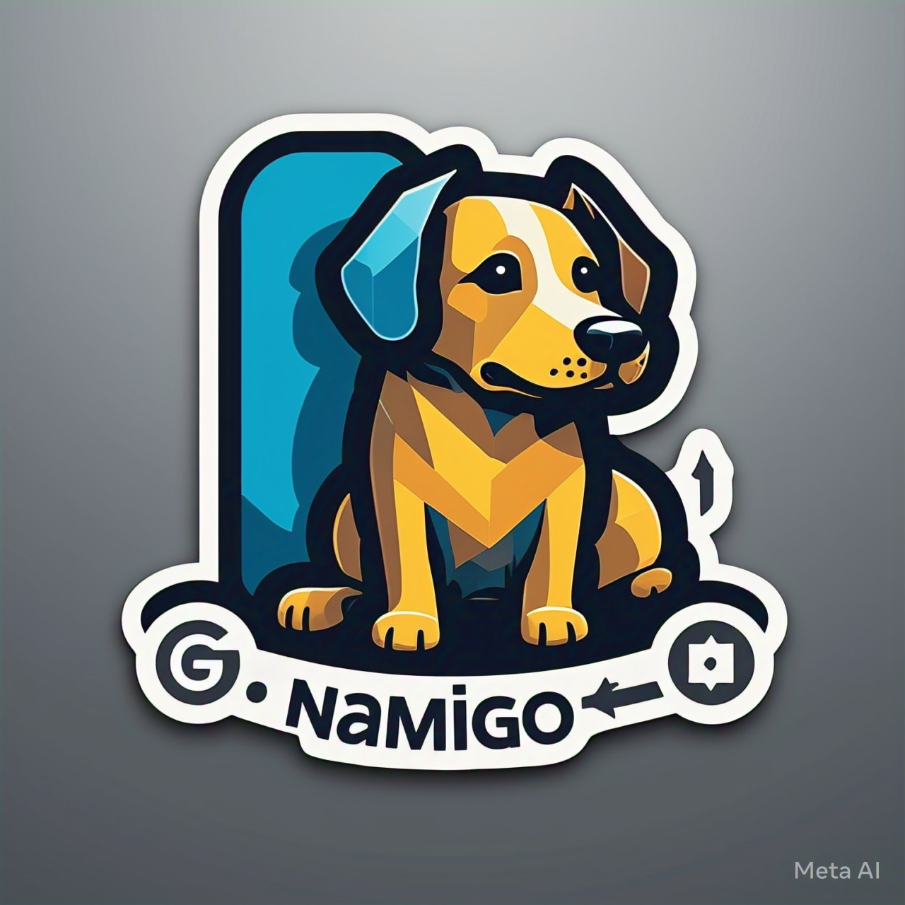

# Namigo

[](https://github.com/huangsam/namigo/actions)
[](https://goreportcard.com/report/github.com/huangsam/namigo)
[](https://github.com/huangsam/namigo/blob/main/LICENSE)

Your naming pal, written in Go 🐶

> It's a dog. It's a friend. It's a Namigo!



## Motivation

Finding the right name for projects is often harder than it seems. Namigo
solves this "naming block" by providing a simple tool to quickly search for
available names across package repositories, DNS, and email, letting you
focus on building. By automating the search process, Namigo saves you time
and effort, ensuring that you can find the perfect name without the usual
hassle.

Additionally, Namigo can generate new names via AI prompts to chatbots,
offering creative and unique suggestions. This feature leverages the power
of artificial intelligence to provide you with a variety of name options
that you might not have considered. Whether you need a name for a new
project, package, domain, or email address, Namigo is your go-to naming pal.

## Getting started

Installing the CLI:

```shell
# With `go install`
go install github.com/huangsam/namigo/cmd/namigo@latest

# With https://github.com/huangsam/namigo/releases
# Access the link with the browser of your choice
# Choose the binary that suits your system's OS and architecture
```

Prompting and searching with CLI:

```shell
# Generate a prompt to get names from AI
namigo generate prompt

# Search for package matches
namigo search package 'hello'

# Search for DNS matches
namigo search dns 'hello'

# Search for email matches
namigo search email 'hello'
```

Here is a screencast to see the CLI in action:


Want to help make Namigo even better? Check out our [contribution guidelines](./CONTRIBUTING.md).
